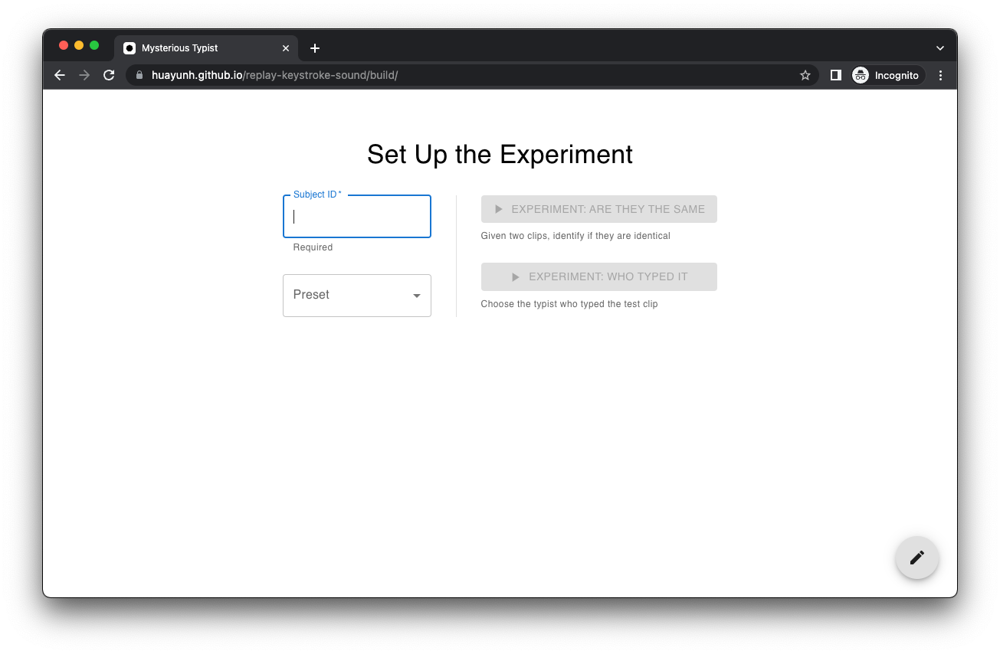
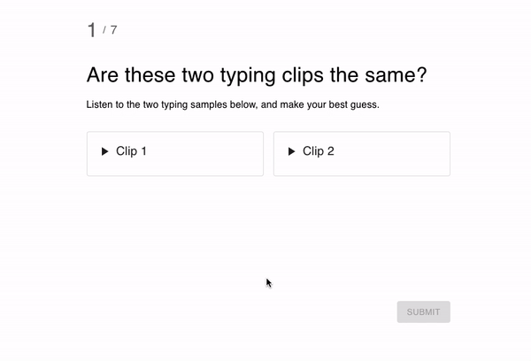
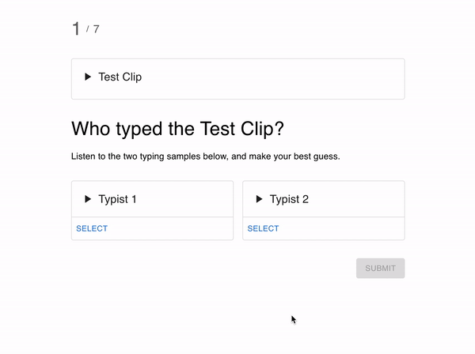
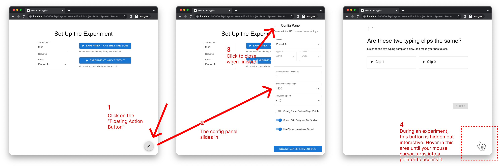
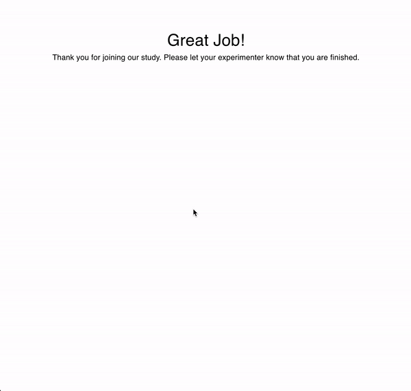

# Replay Keystroke Sound



## About the Experiment

Early day telegraph operators claimed to know who's transmiting on the other end by just listening to the beeping sequence; our lab assistant, after running hundreds of keystroke dynamics experiment sessions, also claims to be able to tell who's typing by ear. Can human use audio clues to distinguish typing rhythms? How well? Can human beat a machine on this topic?

This is a web app used for an academic experiment aiming at comparing human subjects' performance in identifying keystroke sequence variance with that of a computer. You can run it on your browser by [visiting this link](https://huayunh.github.io/replay-keystroke-sound/build). To gain a deep understanding to this problem, the experiment is broken into two separate separate tasks: "Are they the same" and "Who typed it".

### Task: Are They The Same

This task aims at answering the question "how well can a human detect variations in keystroke typing sound". In each question, subjects will be given two clips, "clip 1" and "clip 2", which are usually highly similiar to each other. After clicking on both clips and listen, subjects are then asked to make their judgement on whether these two clips are identical, and indicate their confidence level. This is done by clicking on a slider, where the left end means the two clips are definitely not the same, the right end means the subject is very confident that the two clips are identical, and the mid point indicates that they are ambiguous. This set up is similar to a [visual analogue scale (VAS)](https://www.physio-pedia.com/Visual_Analogue_Scale).



In addition to the experiment configurations (explained below in the "Configurations and Parameters" section), the following events are also recorded in the log file: a clip is played / stopped, a subject clicked on a VAS, a subject clicked on the submit button, and whether the question is answered correctly.

### Task: Who Typed It

A common question asked in machine learning is how well can machine outperform human. This second task focuses on "how well can humans classify a typing sample (by ear)".



### Data Set

All data used in the experiment is based on keystroke data collected in Killourhy and Maxion's Keystroke Dynamics Benchmark Data Set from 2009. During this 2009 experiment, all subjects were asked to type the same string, `.tie5Roanl`, for 400 times (8 sessions, 50 repetitions per session). You may read more about that [on their web page](https://roymaxion.github.io/projects/keystroke-benchmark/benchmark-data-set.html).

This experiment uses all the "keydown" events from the data set to recreate typing sequences. TODO: talk about why we only take the last 10 reps. and how we are taking one out as the test clip.

During the experiment, the sequence of how each clip shows up on the screen follows a specific order controlled by the parameter "preset". This "preset" parameter can be set by an experimenter at the beginning of the experiment on the "Experiment Set Up" screen, where the experimenter can either pick between TODO, or let the web app randomly draw TODO number of typist from the data set. TODO: talks about repeat vs. non repeat

## Configurations and Parameters

### The Config Panel

In the "Set Up the Experiment" page, you will see a floating action button (FAB) to the bottom right corner of your browser. Clicking on this will bring up the config panel, where you can control advanced settings of the tasks.



During an experiment, the FAB is hidden from subject by default to prevent subject from altering the settings, but it remains interactive. Hover around the bottom right corner until your mouse cursor turns into a pointer. Then you can access the config panel as you normally would. The FAB's hidden-during-experiment behavior can be changed by toggling on the "Config Panel Button Stays Visible" setting in the config panel.

### URL Parameters

Experimenters can bookmark the URL to save their settings and reuse them next time they want to run the experiment using the same configuration. This is done by using [URL parameters](<https://www.semrush.com/blog/url-parameters/#:~:text=URL%20parameters%20(known%20also%20as%20%E2%80%9Cquery%20strings%E2%80%9D%20or%20%E2%80%9CURL%20query%20parameters%E2%80%9D)%20are%20elements%20inserted%20in%20your%20URLs%20to%20help%20you%20filter%20and%20organize%20content%20or%20track%20information%20on%20your%20website.>) — every time you make a change to experiment configurations, your URL would change. For example, the first time you open the webpage, the URL address is

```
https://huayunh.github.io/replay-keystroke-sound/build/
```

if you specify the preset to be "Preset C", then you will notice the URL now changes to

```
https://huayunh.github.io/replay-keystroke-sound/build/?preset=Preset%20C
```

Next time you use this same URL above, you will see that the "Preset C" has been automatically selected.

### All Parameters

| Name                 | Accepted Values (TypeScript Notation)                           | Accepted Values ([Encoded](https://en.wikipedia.org/wiki/Percent-encoding) URL) | Description                                                                                                                                                                                                                                                                                                                                                                                                          | Default Value |
| -------------------- | --------------------------------------------------------------- | ------------------------------------------------------------------------------- | -------------------------------------------------------------------------------------------------------------------------------------------------------------------------------------------------------------------------------------------------------------------------------------------------------------------------------------------------------------------------------------------------------------------- | ------------- |
| subjectID            | `string`                                                        | any string                                                                      | A unique identifier for the subject performing the experiment.                                                                                                                                                                                                                                                                                                                                                       |               |
| preset               | <code>'Random' \| 'Preset A' \| 'Preset B' \| 'Preset C'</code> | `Random` or `Preset%20A` or `Preset%20B` or `Preset%20C`                        | Whether to let the program randomly select typists, or to use a pre-defined set of typists.                                                                                                                                                                                                                                                                                                                          |               |
| isFABVisible         | `boolean`                                                       | `true` or `false`                                                               | Whether the floating action button (FAB) on the bottom right corner that can open the configuration panel is open or not.                                                                                                                                                                                                                                                                                            | `false`       |
| isProgressBarVisible | `boolean`                                                       | `true` or `false`                                                               | When a subject plays a typing sequence clip, whether they will see the light blue progress bar or not.                                                                                                                                                                                                                                                                                                               | `true`        |
| variedKeystrokeSound | `boolean`                                                       | `true` or `false`                                                               | Whether to alternate between hard key press sounds and soft key press sounds.                                                                                                                                                                                                                                                                                                                                        | `true`        |
| repsPerTrainingClip  | `number`                                                        | an integer                                                                      | In the "who typed it" task, this controls the number of "reps" sampled from `src/assets/data.json`. <br />For example, `data.json` currently contains 10 reps for each typist. if this parameter is set to 6, then rep No.5 - rep No.10 is played to the subject for each chosen typist. In this example, `repsPerTrainingClip`'s allowed range value is 1-9, because rep No.1 is always reserved as a testing clip. | `1`           |
| silenceBetweenReps   | `number`                                                        | an integer                                                                      | When one rep of a typist is played, how many milliseconds to wait before playing the next rep. Must be greater than 500. Applicable only when `repsPerTrainingClip` is more than 1.                                                                                                                                                                                                                                  | `1500`        |
| playbackSpeed        | <code>0.5 \| 0.75 \| 1.0 \| 1.25</code>                         | `0.5` or `0.75` or `1.0` or `1.25`                                              | The speed at which any clips are played. `1.0` is the regular speed. `0.5` means twice as slow (like "x0.5") while `1.25` means the audio is speed up by 25% ("x1.25").                                                                                                                                                                                                                                              | `1.0`         |

## Log File

### Download the Log File



When the experiment is over, subjects are instructed to notify the experimenter, who will then take over and proceed to download the experiment log file through the hidden config panel.

This program runs purely in a web browser. There is no server, meaning that this log file is not saved remotely somewhere in a "cloud". If, for some reason, the browser is closed or refreshed, then all log data would be lost, and the experiment will reset to its initial stage.

### Interpret the Log File

The logs are saved in the [CSV file format](https://en.wikipedia.org/wiki/Comma-separated_values) and consisted of two parts: summary and events.

-   The **summary** tracks configurations and timestamps for the experiment and includes a brief report for subject's answers to each question.
-   The **event log** section logs a new entry when a subject takes certain actions. These include when a new question is generated, when a clip is played, when a choice is made, and when the submit button is clicked.

A snippet from the event log section may look like this:

```CSV
Subject ID,Question No.,Timestamp (UTC),Timestamp (Local),Time Elapsed (hh:mm:ss.ddd),Typist 1,Typist 2,Event,Typist Played,Confidence Level,Decision
...
JaneSmith,1,2022-04-30 00:46:57.253,2022-04-29 20:46:57.253,0:00:04.558,s003,s004,Play,Clip 2 (s004),null,null
```

Here's the interpretation: a subject named "JaneSmith" is in the middle of an "are they the same" experiment — you can tell because we are measuring "Confidence Level" here. At April 29, 2022 8:46:57 PM local time, which is 4.558 seconds since her last action in the event log, JaneSmith is still on her first question and has two typing clips on her screen — one from "s003" and the other from "s004". JaneSmith has just played the typing clip labeled "Clip 2" on her screen, which, in this case, comes from "s004". At this point, JaneSmith has not made a decision whether she's confident that the two clips are the same or not, so the "Confidence Level" column contains a "null" in it. Since this is not a "answer submitted" event, the "Decision" column, which is used to display whether the subject's answer is correct or wrong, remains "null".

## For Developers

The following content is for developers who understand web development and want to alter some fundamental behaviors of the project, such as adding new pages and altering presets. This project is constructed using JavaScript under the [React](https://reactjs.org/) framework, and with significant help from [MUI](https://mui.com/) (for UI components) and [React Redux](https://react-redux.js.org) (for state controls).

### Environment

For a small-scaled project like this, the environment versioning usually does not affect the outcome significantly. Yet If you want to guarantee an identical result as mine, you would need to set up the same dev environment.

-   [node](https://nodejs.org/en/) v14.17.6
-   [yarn](https://yarnpkg.com/) v1.22.10
-   MacOS 11.6.3
-   Google Chrome version 100.0.4896.127

### Commands

I will not repeat the basics of [how-to-git](https://git-scm.com/) here. The following content assumes you've set up your environment, cloned the project from [my repository](https://github.com/huayunh/replay-keystroke-sound) and is currently at the project root directory.

To run, do `yarn && yarn start`.

If you made some changes to the raw data stored at `./scripts/data.json`, you need to run `yarn update-data`. This will parse and update the data located at `src/assets/data.json`, accordingly.

Before you `git push`, run `yarn build` so that the latest code get built in the production mode in the `./build` folder.

### File Tree

```
root
|── /assets                       // screenshots and GIFs of this readme
|── /build                        // the production build, so that this
                                  // whole thing runs on GitHub Pages
|── /public                       // assets fetched directly via HTTP requests
|── /scripts                      // scripts to aid commands specified
                                  // in package.json
└── /src                          // all source code
    |── /assets                   // medias used by the app (ex. keystroke sound)
    |── /components               // UI components
    |── /hooks                    // React hooks
    |── /redux                    // app state controls using Redux
    └── /shared                   // shared constants and utility functions,
                                  // including presets
```

### To Change What's In a Preset

The preset values are all stored at `src/shared/constants.js`. To change the value of a preset, you may simply edit the file directly and save.

### To Add / Remove a Preset

Adding / deleting presets would involve changing import statements, so it is a little more complicated than just changing preset contents. If you try to add a new preset, the following places need to be altered.

Specify a new preset in

```
src/shared/constants.js
```

Change the import statement and if statement in

```
src/redux/appSlice.js
```

Note that you will also want to change those inline comments to keep the documentation consistent; I encourage you to do a full-document search for this file.

Finally, change the UI controls for the Config Panel and the experiment set up page:

```
src/components/ConfigPanel.jsx
src/pages/ExperimentSetUp.jsx
```

### To Control What's Exported in the Log File

As mentioned in the "Interpret the Log File" section above, there are two sections in the log file: summary and event log. The download action is triggered inside the `<DownloadButton>` component. The summary section is generated in the `src/components/DownloadButton.jsx` file; the event log is generated by calling the `logText` function in `src/redux/appSlice.js`.
